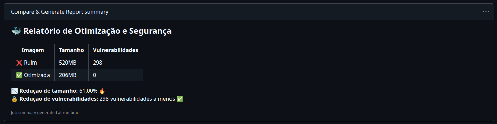

# 🐳 Docker Multi-Stage Optimization

[](https://github.com/DevOpsProjectsLab/docker-multistage/actions)


O **Docker Multi-Stage** é um projeto desenvolvido no âmbito da organização **[DevOpsProjectsLab](https://github.com/DevOpsProjectsLab)** com o objetivo de **demonstrar, de forma prática e mensurável**, os benefícios da utilização de **Docker multi-stage builds** em aplicações Java.

O repositório contém dois `Dockerfile`s — um **mal otimizado** e outro **multi-stage**, e a pipeline compara automaticamente o tamanho final das imagens e o número de vulnerabilidades em cada uma, destacando o ganho em segurança, performance e eficiência.

---

## 🧰 Tecnologias Utilizadas

- **Java 21** — Linguagem principal da aplicação
- **Maven 3.9.6** — Gerenciador de dependências e build
- **Docker** — Contêinerização da aplicação
- **Hadolint** — Linter para validação de boas práticas em Dockerfiles
- **Trivy** — Scanner de vulnerabilidades e segurança
- **GitHub Actions** — CI/CD para automação e relatórios

---

## 🏗️ Estrutura do Projeto

```bash
docker-multistage/
├── .github/
│   └── workflows/
│       └── ci.yml                 # Pipeline CI/CD principal
│
├── app/
│   ├── src/main/java/com/devopsprojectslab/App.java  # Aplicação Java simples
│   └── pom.xml                   # Configuração do Maven (com mainClass definida)
│
├── docker/
│   ├── Dockerfile.bad            # Dockerfile mal otimizado
│   └── Dockerfile.optimized      # Dockerfile multi-stage otimizado
│
└── README.md
```

---

## ⚙️ Pipeline CI/CD

O workflow [`ci.yml`](.github/workflows/ci.yml) orquestra o processo completo de validação, build e comparação das imagens Docker.

### 🧩 Estrutura de Jobs

| Job | Descrição |
|-----|------------|
| `Lint` | Valida as boas práticas dos Dockerfiles usando **Hadolint** |
| `Build` | Constrói as duas imagens (`java-bad` e `java-optimized`) e exporta como artefatos `.tar` |
| `Security` | Escaneia vulnerabilidades nas imagens com **Trivy** |
| `Report` | Compara tamanhos e vulnerabilidades e gera relatório no GitHub Summary |

---

## 📊 Resultados de Otimização

Durante a execução do pipeline, o GitHub Actions gera automaticamente um relatório comparando as imagens.

### 🧱 Imagem Mal Otimizada (`docker/Dockerfile.bad`)
- Base: `maven:3.9.6-eclipse-temurin-21`
- Inclui ferramentas de build e dependências desnecessárias
- Usuário root
- **Tamanho final:** 520 MB  
- **Vulnerabilidades:** 298 detectadas

### 🚀 Imagem Otimizada (`docker/Dockerfile.optimized`)
- Base: `eclipse-temurin:21-jre-alpine`
- Multi-stage: separa build e runtime
- Remove dependências e ferramentas de compilação
- Executa como usuário não-root
- **Tamanho final:** 206 MB  
- **Vulnerabilidades:** 0 detectadas

### 📈 Ganho Total
- 🔹 **Redução de tamanho:** ~61%  
- 🔹 **Redução de vulnerabilidades:** -298 CVEs  



> Esses resultados são calculados automaticamente pelo job `Report` e exibidos diretamente no painel do GitHub Actions.

---

## 🧠 Benefícios do Multi-Stage Build

O uso de **multi-stage builds** traz ganhos significativos para pipelines modernas de CI/CD:

| Benefício | Descrição |
|------------|------------|
| 🚀 **Imagens menores** | O estágio final contém apenas o necessário para execução, reduzindo drasticamente o tamanho. |
| 🔒 **Maior segurança** | Ferramentas de build e pacotes desnecessários são removidos, reduzindo a superfície de ataque. |
| ⚙️ **Deploy mais rápido** | Menor tamanho → menor tempo de push/pull e inicialização de contêineres. |
| 🧩 **Manutenção facilitada** | Separação clara entre build e runtime. |
| 💡 **Padrão recomendado pela Docker Inc.** | Multi-stage é a abordagem oficial para imagens leves e seguras. |

---

## 💻 Executando Localmente

### 1️⃣ Construir as imagens

```bash
docker build -t java-bad -f docker/Dockerfile.bad .
docker build -t java-optimized -f docker/Dockerfile.optimized .
```

### 2️⃣ Comparar tamanhos

```bash
docker images | grep java-
```

### 3️⃣ Rodar aplicação

```bash
docker run --rm java-optimized
```

### 4️⃣ Escanear vulnerabilidades (localmente com Trivy)

```bash
trivy image java-bad
trivy image java-optimized
```

---

## 🔍 Lint de Dockerfiles

O lint é executado automaticamente no pipeline via **Hadolint**, garantindo a conformidade com as boas práticas da Docker Community.

Exemplo de execução local:
```bash
docker run --rm -i hadolint/hadolint < docker/Dockerfile.bad
docker run --rm -i hadolint/hadolint < docker/Dockerfile.optimized
```

---

## 📄 Exemplo de Relatório Gerado

Durante a execução do workflow, o GitHub Summary exibe:

| Imagem | Tamanho | Vulnerabilidades |
|---------|----------|------------------|
| ❌ Ruim | 520MB | 298 |
| ✅ Otimizada | 206MB | 0 |

📉 **Redução total:** 61% de tamanho e eliminação de todas as vulnerabilidades conhecidas.  

---

## 🧩 Destaques Técnicos

Este projeto demonstra:

- Implementação prática de **Docker Multi-Stage Builds**
- Comparação **quantitativa** de otimização (tamanho + CVEs)
- Análise de segurança automatizada com **Trivy**
- Validação de boas práticas com **Hadolint**
- Pipeline GitHub Actions completo e modular
- Relatórios automáticos no **GitHub Summary**

---

<p align="center">
  <sub>Desenvolvido e mantido por <a href="https://github.com/DevOpsProjectsLab" target="_blank">DevOpsProjectsLab</a> · Atualizado em Outubro de 2025</sub>
</p>